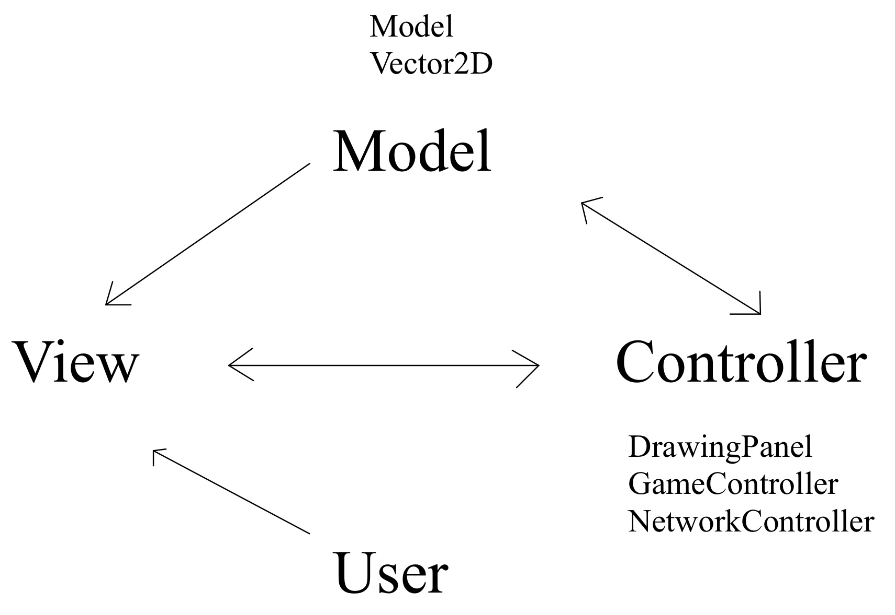



<!-- HTML -->

    

<h1 align="center">Software Practice I | CS 3500 Spring 2021</h1>
<!-- HTML -->

## Features

#### Client

- "W", "S", "A", "D" to move the tank up, down, left, right respectiely.

- Use mouse to change orientation of the turret.

- Left-click for firing a normal attack, right-click to fire a bean attack.

- When starting the client, player will be able to choose their own server address and name.

- When error happens, a dialog will pop-up for notifying player.

#### Server

Server have not yet implemented.

## Solution Structure

#### NetworkController

[NetworkController](Libraries/) is a general-purpose (text-based communication) networking library.

The pre-compiled DLL located in the [Resources](Libraries/) project.

#### GameController

[GameController](../GameController) project is responsible for parsing information received from the NetworkController, and updating the model.

#### Model

The models inside [Model](../Model/) project represent the game state and game logic for TankWars.

The project contains following classes:

- [Beam](../Model/)

- [Explosion](../Model/)

- [Powerup](../Model/)

- [Projectile](../Model/)

- [Tank](../Model/)

- [Wall](../Model/)

- [World](../Model/)

#### Resources

[Resources](../Resources) Project contains essential files for the game to run. (Images, Pre-compiled DLL)

#### Vector2D

[Vector2D](../Vector2D) project is representing a two-dimentional space vector for the game.

#### View

[View](../View) project is responsible create the player's GUI for this game.

## Design Pattern

For this project, the editors used [Model–View–Controller](https://en.wikipedia.org/wiki/Model–view–controller) as our software design pattern.

As our projects' naming, this solution is clearly structured:

